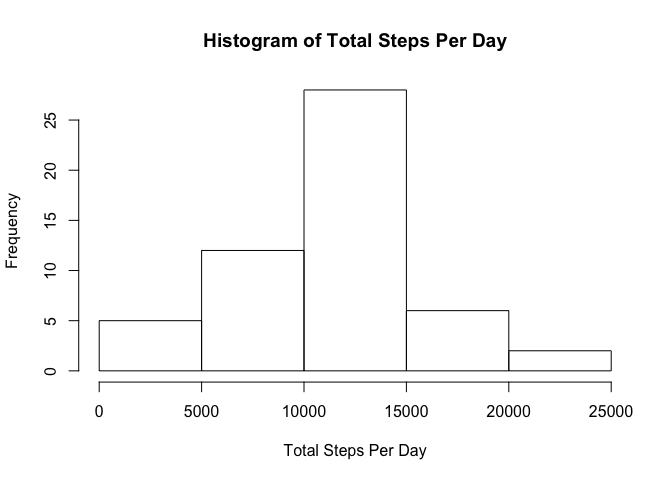
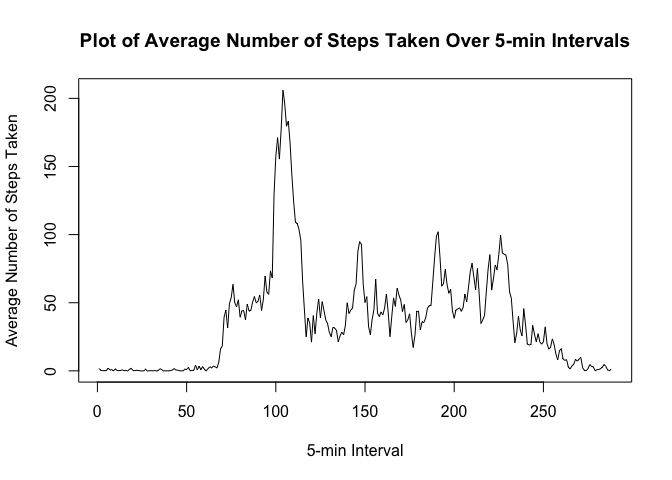
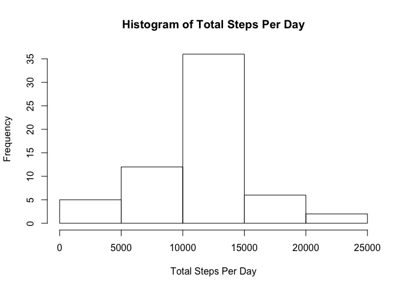
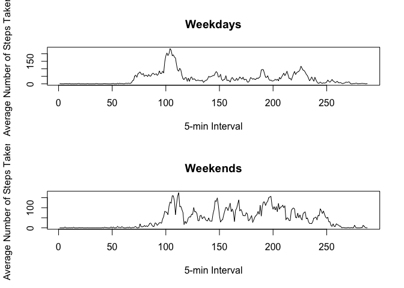

# Reproducible Research: Peer Assessment 1
Premal Patel  
Sunday, November 13, 2016  
###### Created with knitr in RStudio v.0.99 on MacOSX.11.16
###### github repo with RMarkdown source code: https://github.com/patelpp/RepData_PeerAssessment1
This assignement is Peer Assessment 1 for Reproducible Research Coursera class by John Hopkins. The paper contains the process of the analysis of the data. 
#Introduction

It is now possible to collect a large amount of data about personal movement using activity monitoring devices such as a Fitbit, Nike Fuelband, or Jawbone Up. These type of devices are part of the “quantified self” movement – a group of enthusiasts who take measurements about themselves regularly to improve their health, to find patterns in their behavior, or because they are tech geeks. But these data remain under-utilized both because the raw data are hard to obtain and there is a lack of statistical methods and software for processing and interpreting the data.

This assignment makes use of data from a personal activity monitoring device. This device collects data at 5 minute intervals through out the day. The data consists of two months of data from an anonymous individual collected during the months of October and November, 2012 and include the number of steps taken in 5 minute intervals each day.

##Setup R Environment
A single R markdown doc is created that can be processed by knitr and transformed into a HTML file.

As requested, echco equals true.

```r
library(knitr)
echo = TRUE
```

## Loading and preprocessing the data
Load input data from zip file from the current R directory.


```r
unzip("activity.zip") #unzip archive
data <- read.csv ("activity.csv", header = T, sep = ",") #read into data file
data$date <- as.Date(data$date, format ="%Y-%m-%d") #convert date column to date type
```

## What is mean total number of steps taken per day?

1. Make a histogram of the total number of steps taken each day

Calculate the total steps per day.

```r
steps_day <- aggregate(steps ~ date, data, sum)
```

Histogram plot

```r
hist(steps_day$steps, 
xlab = "Total Steps Per Day", 
main = "Histogram of Total Steps Per Day")
```

<!-- -->
2. Calculate and report the mean and median total number of steps taken per day

Calculate Mean

```r
mean(steps_day$steps)
```

```
## [1] 10766.19
```
Mean is 10766.19

Calculate Median

```r
median(steps_day$steps)
```

```
## [1] 10765
```
Median is 10765
## What is the average daily activity pattern?
1. Make a time series plot (i.e. type = "l") of the 5-minute interval (x-axis) and the average number of steps taken, averaged across all days (y-axis)

Calculate the sum of steps by intervals of 5 minutes and average number of steps taken

```r
mean_interval_steps <- tapply(data$steps, data$interval, mean, na.rm=T)
```
Plot time series plot 

```r
plot(mean_interval_steps, type="l", 
xlab = "5-min Interval", 
ylab ="Average Number of Steps Taken",
main = "Plot of Average Number of Steps Taken Over 5-min Intervals")
```

<!-- -->

2. Which 5-minute interval, on average across all the days in the dataset, contains the maximum number of steps?

Find interval with max number of steps.

```r
which(mean_interval_steps == max(mean_interval_steps))
```

```
## 835 
## 104
```
The interval with max number of steps is 835th.

## Imputing missing values
1. Calculate and report the total number of missing values in the dataset (i.e. the total number of rows with NAs)


```r
table(is.na(data)==TRUE)
```

```
## 
## FALSE  TRUE 
## 50400  2304
```
There are a total of 2304 NAs.

2. Devise a strategy for filling in all of the missing values in the dataset. The strategy does not need to be sophisticated. For example, you could use the mean/median for that day, or the mean for that 5-minute interval, etc.

Replace NAs in orginal data with mean_interval_steps values

3. Create a new dataset that is equal to the original dataset but with the missing data filled in.


```r
na_data <- data #create a copy of data 
mean_interval_steps2 <- rep(mean_interval_steps, 61) #repeat for the number of days 
for (i in 1:nrow(data)){
  if (is.na(data$steps[i])){
      na_data$steps[i] <- mean_interval_steps2 [i]
  }
}
```
4. Make a histogram of the total number of steps taken each day and Calculate and report the mean and median total number of steps taken per day. Do these values differ from the estimates from the first part of the assignment? What is the impact of imputing missing data on the estimates of the total daily number of steps?


```r
steps_day2 <- aggregate(steps ~ date, na_data, sum)

hist(steps_day2$steps, 
xlab = "Total Steps Per Day", 
main = "Histogram of Total Steps Per Day")
```

<!-- -->

```r
mean(steps_day2$steps)
```

```
## [1] 10766.19
```

```r
median(steps_day2$steps)
```

```
## [1] 10766.19
```
The median differs in that the data with missing values replaced has the the same value as the mean for the new data set at 10766.19

## Are there differences in activity patterns between weekdays and weekends?

1. Create a new factor variable in the dataset with two levels -- "weekday" and "weekend" indicating whether a given date is a weekday or weekend day.


```r
weekdata <- data
weekdata$date <- as.Date(weekdata$date)
weekdata$day <- weekdays(weekdata$date)

weekdata_days <- weekdata[(!weekdata$day %in% c("Saturday","Sunday")),]

weekdata_ends <- weekdata[(weekdata$day %in% c("Saturday","Sunday")),]

mean_interval_steps_days <- tapply(weekdata_days$steps, weekdata_days$interval, mean, na.rm=T)

mean_interval_steps_ends <- tapply(weekdata_ends$steps, weekdata_ends$interval, mean, na.rm=T)

par(mfrow=c(2,1))
plot(mean_interval_steps_days, type="l", 
xlab = "5-min Interval", 
ylab ="Average Number of Steps Taken",
main = "Weekdays")

plot(mean_interval_steps_ends, type="l", 
xlab = "5-min Interval", 
ylab ="Average Number of Steps Taken",
main = "Weekends")
```

<!-- -->
There seems to be that Weekdays are usually more steps early in the day. On Weekends there is constant activity throughout the day.
